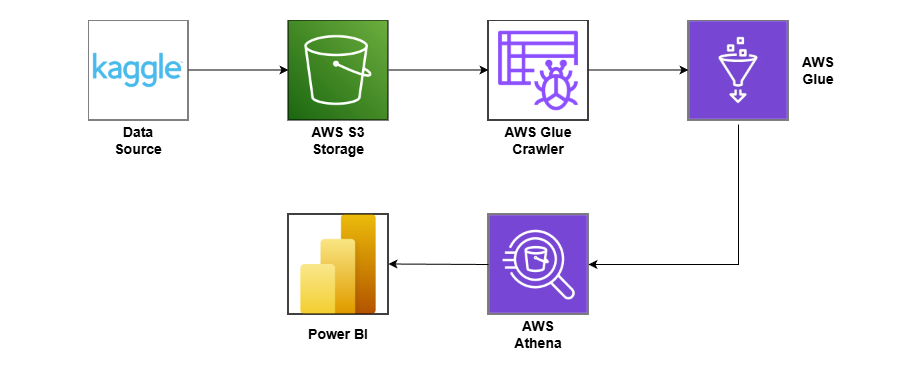

# 🧩 Data Developer Salary, AWS ETL Pipeline: Kaggle → S3 → Glue → Athena → Power BI
This project demonstrates a complete cloud-based ETL and analytics workflow using AWS services. The pipeline ingests raw data from Kaggle, stores it in Amazon S3, transforms it using AWS Glue, queries it using Amazon Athena, and visualizes insights in Power BI.

## 🚀 Architecture Overview


Pipeline Flow:
1. Kaggle – Raw dataset downloaded from Kaggle.
2. Amazon S3 – Raw files uploaded to an S3 data lake (“raw” zone).
3. AWS Glue Crawler – Automatically infers schema from raw data and populates AWS Glue Data Catalog.
4. AWS Glue ETL Job – Cleans, transforms, and converts raw data into an optimized format (e.g., CSV).
5. Amazon Athena – SQL queries on curated S3 datasets.
6. Power BI – Visualizes insights.

## 📂 Project Structure
```
├── data/
│   └── raw/dataset_salary_2024_raw.csv
│   └── processed/data_salary2024_maxbyjobtitle.xlsx
│   └── processed/data_salary2024_maxbyjoblevel.xlsx
├── glue/
│   └── data-salary-2024-agg.py
├── athena/sql/
│   └── dataset-salary-maxbyjobtitle
│   └── dataset-salary-maxbylevel
├── visuals/
│   └── data_salary2024_pbix.pbix
└── README.md
```

## 🛠️ Technologies Used
- Amazon S3
- AWS Glue (Crawler + ETL)
- Amazon Athena
- Kaggle
- Power BI

## 🔄 ETL Workflow
### 1. Data Ingestion
Raw Kaggle dataset uploaded to S3:
`s3://amzn-s3-dataset-salary/csv/dataset_salary_2024.csv`

### 2. Glue Crawler
Scans raw files → Generates schema → Registers tables in Glue Data Catalog.

### 3. Glue ETL
Cleans & transforms data, converts to CSV, writes to:
`s3://amzn-s3-dataset-salary/product_1`
`s3://amzn-s3-dataset-salary/product_2`

### 4. Athena Query Layer
Runs validation and analytics SQL queries on processed CSV data.

### 5. Power BI Visualization
Power BI connects to Athena via ODBC to visualize metrics and trends.

## 📈 Key Features
- Fully serverless ETL pipeline
- Automated schema detection
- Optimized S3 data lake (Parquet format)
- Athena-powered analytics
- BI-ready curated data

## 🧠 Skills Demonstrated
- Cloud ETL development
- Glue PySpark transformations
- Data modeling
- SQL analytics
- Dashboard design in Power BI

## ▶️ How to Reproduce
1. Clone / Download Repo
2. Upload Raw CSV to S3 
3. Run Glue Crawler & ETL
4. Query data in Athena
5. Build Power BI Dashboard Seperately
